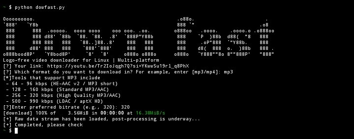
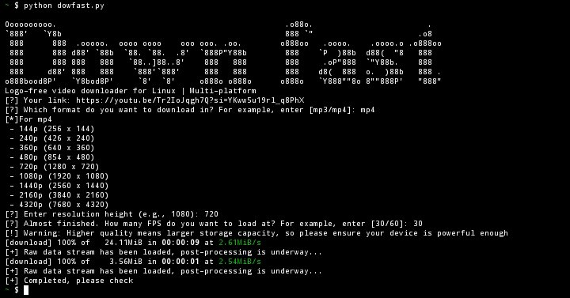

# Download-Fast-Tool
A cross-platform, logo-free video and music downloader.
# Dowfast - Logo-Free Video & Audio Downloader

A lightweight, intuitive Command-Line Interface (CLI) utility built on

top of the `yt_dlp`

library[span_0](start_span)[span_0](end_span)[span_1](start_span)[span

_1](end_span). **Dowfast** supports downloading high-quality videos or

extracting audio from multiple online platforms without any watermarks

or logos, optimized for Linux and terminal-based environments (such as

Termux, WSL, Arch, and

Ubuntu)[span_2](start_span)[span_2](end_span)[span_3](start_span)[span

_3](end_span).

## 🚀 Key Features

* **Flexible Multi-Platform Downloading:** Seamlessly download media

from YouTube, TikTok, Facebook, and hundreds of other platforms

supported by the `yt-dlp` core

engine[span_4](start_span)[span_4](end_span)[span_5](start_span)[span_

5](end_span).

* **Format & Quality Customization:**

* **Audio (MP3):** Select a custom bitrate ranging from

low-storage settings (64 kbps) up to premium studio quality

(supporting high-end options up to 990

kbps)[span_6](start_span)[span_6](end_span)[span_7](start_span)[span_7

](end_span).

* **Video (MP4):** Choose exact resolution heights from 144p up to

ultra-sharp 4K/8K (4320p) along with target frame rates (30/60

FPS)[span_8](start_span)[span_8](end_span)[span_9](start_span)[span_9]

(end_span).

* **Custom Real-Time Progress Bar:** Replaces dense default library

logs with a clean, responsive console progress bar showing download

percentage (`%`) and downloaded size (`MB`) in real

time[span_10](start_span)[span_10](end_span)[span_11](start_span)[span

_11](end_span).

* **Graceful Process Interruption:** Built-in handling for `Ctrl + C`

(`KeyboardInterrupt`) ensures the script terminates smoothly without

leaving behind corrupted or locked file

streams[span_12](start_span)[span_12](end_span)[span_13](start_span)[s

pan_13](end_span).

---

## 🛠 System Requirements & Prerequisites

To ensure the script runs smoothly, your system needs the following
components installed[span_14](start_span)[span_14](end_span):

1. **Python 3.x**

2. **yt-dlp** (The core stream extraction

engine)[span_15](start_span)[span_15](end_span)

3. **FFmpeg** (Mandatory for post-processing: merging separate

high-quality video/audio streams or converting audio to

MP3)[span_16](start_span)[span_16](end_span)[span_17](start_span)[span

_17](end_span)

### Installation Guide

**1. Install Python Dependencies:**

```bash

pip install yt-dlp
```
2. Install FFmpeg (Platform-Specific):
● Ubuntu / Debian / Kali Linux:
```bash
sudo apt update && sudo apt install ffmpeg
```

● Arch Linux:
```bash
sudo pacman -S ffmpeg
```
● Termux (Android):
```bash
pkg install ffmpeg
```

● macOS (via Homebrew):
```bash
brew install ffmpeg
```

💻 How to Use

Launch the downloader by running the script directly from your terminal:
```bash
python dowfast.py
```
Interactive Steps:

1. Provide URL: Paste the link of the video you wish to download.

2. Select Format: Type mp4 for video or mp3 for audio.

3. Configure Quality: Enter your desired bitrate (for audio) or resolution & FPS (for video).

Press Enter to skip and fall back to the maximum available quality defaults.

[!] Warning: Downloading at extreme resolutions (2K/4K/8K) combined with 60 FPS requires

solid device processing power during the final FFmpeg muxing (post-processing) phase.

📝 Code Architecture Overview

● progress_hook(d): Intercepts raw stream data fragments to calculate download metrics

and render the dynamic Loading [=== ] progress status.

● main(): Orchestrates the user interaction CLI loop, processes inputs, updates the

selective ydl_opts configuration payload, and safely initializes the download lifecycle.

⚖️ Disclaimer

This tool is strictly developed for educational, research, and personal archiving purposes.
Please respect content creators' copyrights and adhere to the terms of service of the respective

platforms you interact with.
# MP3
<p align="center">
  
</p>

# MP4
<p align="center">
  
</p>


